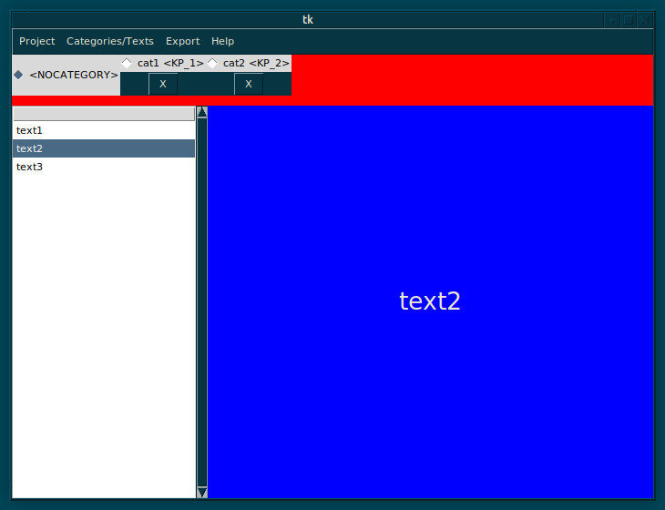

# text-label
```
<Double-Button-1> - select text from list
<Control-n> - new (empty) project
<Control-o> - open existing project
<Control-s> - save project
<Control-k> - add category
<Control-i> - insert text from popup
<Control-f> - import text from file
<Control-z> - undo
<KeyPress-Delete> - delete selected text

<KeyPress-Left>/<KeyPress-Up> - select previous text
<KeyPress-Right>/<KeyPress-Down> - select next text

<KeyPress-equal>/<Control-KP_Add> - make font larger
<KeyPress-KP_Subtract>/<Control-minus> - make font smaller
```
